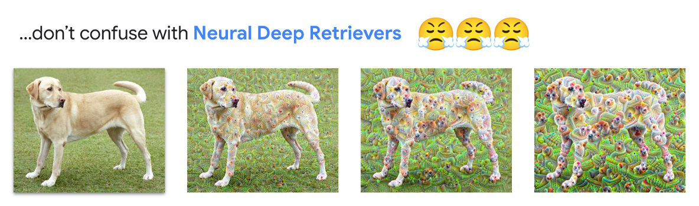

# RAG from scratch w/ Vertex AI

> These code examples demonstrate how to implement a RAG workflow using Vertex managed services (e.g., Vector Search, Batch Prediction), as well as APIs from the GenAI stack (e.g., Gemini, Embeddings for Text, Grounding, Ranking). Additionally, we use [Document AI](https://cloud.google.com/document-ai/?hl=en) to organize, annotate, and chunk our documents

## Key highlights

1. the RAG is *grounded*, meaning the LLM's output is tethered to specific, verifiable sources of information. This service supports grounding with my proprietary data, as well as Google Search (see [Grounding API](https://cloud.google.com/vertex-ai/generative-ai/docs/grounding/overview) for details)
2. Document AI's [Layout Parser](https://cloud.google.com/document-ai/docs/layout-parse-chunk) is specifically designed for creating chunks of desired sizes while also maintaining location information from a documents hierarchy: `title > chapter > section > ... headings`
3. the [Ranking API](https://cloud.google.com/generative-ai-app-builder/docs/ranking) reranks a list of candidate documents based on their relevancy to a corresponding query. This contrasts embedding retreival which look only at the semantic similarity of query and candidate pairs
4. [Vertex AI Vector Search](https://cloud.google.com/vertex-ai/docs/vector-search/overview) is the vector database of choice. This service maintains high QPS and retreival recall as it scales to billions of vectors. It also supports filtering and enforcing diversity at query time

```
├── README.md
├── imgs
├── notebooks
│   ├── 01_ingest_rag.ipynb
│   ├── 02_embeddings_rag.ipynb
│   ├── 03_index_and_retrieve_rag.ipynb
│   ├── 04_ranked_rag.ipynb
│   ├── autosxs_eval_llama.ipynb
│   └── files
│       ├── embeddings-api
│       ├── lending
│       └── mlb
├── requirements.txt
└── src
    ├── display_utils.py
    ├── docai_utils.py
    ├── gcs_loader.py
    └── vvs_utils.py
```

<details>
  <summary>How does RAG work?</summary>
    

    
</details>


# Using this Repo


#### Setup instructions

<details>
  <summary>Install Vertex AI SDK and Other Packages</summary>

Run the following in a terminal:

```
pip install google-cloud-aiplatform --upgrade --quiet
pip install google-cloud-discoveryengine --upgrade --quiet
pip install google-cloud-documentai google-cloud-documentai-toolbox --upgrade --quiet
pip install google-cloud-storage --upgrade --quiet
pip install langchain-google-community --upgrade --quiet
pip install langchain-google-vertexai --upgrade --quiet
pip install langchain-google-community[vertexaisearch] --upgrade --quiet
pip install langchain-google-community[docai] --upgrade --quiet
pip install rich --upgrade --quiet
```

</details>

<details>
  <summary>Google Cloud IAM permissions</summary>

* `roles/serviceusage.serviceUsageAdmin` to enable APIs
* `roles/iam.serviceAccountAdmin` to modify service agent permissions
* `roles/aiplatform.user` to use AI Platform components
* `roles/storage.objectAdmin` to modify and delete GCS buckets
* `roles/documentai.admin` to create and use Document AI Processors
* `roles/discoveryengine.admin` to modify Vertex AI Search assets
    
</details>

### Random tips

[1] run this command in terminal from root to clear `__pycache__` files:

> `find . | grep -E "(/__pycache__$|\.pyc$|\.pyo$)" | xargs rm -rf`

[2] get the status of a long running operation (LRO)

```
curl -X GET \
     -H "Authorization: Bearer $(gcloud auth print-access-token)" \
     "https://{LOCATION}-documentai.googleapis.com/v1/projects/{PROJECT_ID}/locations/{LOCATION}/operations/{OPERATION_ID}"
```

### Google Cloud services

* The [Document AI Layout Parser](https://cloud.google.com/document-ai/docs/layout-parse-chunk): The Document AI Layout Parser transforms documents in various formats into structured representations, making content like paragraphs, tables, lists, and structural elements like headings, page headers, and footers accessible, and creating context-aware chunks that facilitate information retrieval in a range of generative AI and discovery apps.

* [Vertex AI Embeddings API](https://cloud.google.com/vertex-ai/generative-ai/docs/embeddings/get-text-embeddings): The Vertex AI embeddings APIs let you create embeddings for text or multimodal inputs. Embeddings are vectors of floating point numbers that are designed to capture the meaning of their input. You can use the embeddings to power semantic search using Vector search.

  * > For more information, see [Text embeddings](https://cloud.google.com/vertex-ai/generative-ai/docs/embeddings/get-text-embeddings) and [Multimodal embeddings](https://cloud.google.com/vertex-ai/generative-ai/docs/embeddings/get-multimodal-embeddings) in the Generative AI on Vertex AI documentation.

* [Vertex AI Vector Search](https://cloud.google.com/vertex-ai/docs/vector-search/overview): The retrieval engine is a key part of your RAG or search application. Vertex AI Vector Search is a retrieval engine that can search from billions of semantically similar or semantically related items at scale, with high queries per second (QPS), high recall, low latency, and cost efficiency. It can search over dense embeddings, and supports sparse embedding keyword search and hybrid search in Public preview.

* [Vertex Ranking API](https://cloud.google.com/generative-ai-app-builder/docs/ranking): The ranking API takes in a list of documents and reranks those documents based on how relevant the documents are to a given query. Compared to embeddings that look purely at the semantic similarity of a document and a query, the ranking API can give you a more precise score for how well a document answers a given query.

* [Vertex Grounded Generation API](https://cloud.google.com/generative-ai-app-builder/docs/grounded-gen): Use the grounded generation API to generate well-grounded answers to a user's prompt. The grounding sources can be your Vertex AI Search data stores, custom data that you provide, or Google Search.

* [Vertex Check Grounding API](https://cloud.google.com/generative-ai-app-builder/docs/check-grounding): The check grounding API determines how grounded a given piece of text is in a given set of reference texts. The API can generate supporting citations from the reference text to indicate where the given text is supported by the reference texts. Among other things, the API can be used to assess the grounded-ness of responses from a RAG systems. Additionally, as an experimental feature, the API also generates contradicting citations that show where the given text and reference texts disagree.

---

